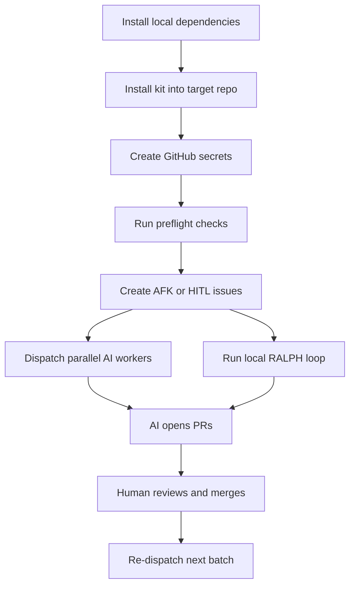

# AI Orchestration Kit

This kit is the reusable process layer for AI-first software delivery.

It is intentionally app-agnostic: you bring product context and architecture decisions, AI executes the implementation work.

## Outcome and pass criteria

After this guide, a developer can:

1. Install orchestration once with near-zero hand wiring.
2. Dispatch AI work safely and repeatedly.
3. Review/merge AI PRs with clear traceability.
4. Understand why each step exists, not just what to run.

## Process map



## Installations first

Do this once per machine.

1. Install GitHub CLI and authenticate.
2. Install Claude Code CLI.
3. Install `jq`.
4. Confirm Docker Desktop is installed and running.

Quick check:

```bash
gh --version && claude --version && jq --version && docker --version
```

Reasoning: these tools are the minimum runtime dependencies for all orchestration modes.

## Step-by-step onboarding

### 1) Install the kit into a target repository

From this repository root:

```bash
bash orchestration-kit/scripts/install-into-target.sh /absolute/path/to/target-repo
```

Reasoning: this single command copies workflows, scripts, issue templates, planning files, and Claude starter config so you avoid manual file-by-file setup.

### 2) Configure GitHub secrets in the target repository

```bash
cd /absolute/path/to/target-repo
bash scripts/setup-github-secrets.sh
```

Required secrets:

1. `CLAUDE_CODE_OAUTH_TOKEN`
2. `GH_READ_TOKEN`

Reasoning: workers run on GitHub Actions and need auth to Claude + issue context.

### 3) Run preflight checks

```bash
bash scripts/preflight-check.sh
```

Reasoning: fail fast on missing dependencies, workflow file, auth, or secrets before dispatching work.

### 4) Feed issues in the correct contract

Use `.github/ISSUE_TEMPLATE/ai-afk-task.yml` in the target repo.

Required structure:

1. `Type`: AFK or HITL
2. `Goal`
3. `Acceptance Criteria`
4. Optional `Blocked by`
5. `Notes`

Reasoning: deterministic issue shape enables reliable orchestration and dependency handling.

### 5) Run orchestration

Parallel GitHub Actions mode:

```bash
bash scripts/dispatch.sh
gh run list --workflow=ai-agent-work.yml
```

Planning-driven local loop mode:

```bash
bash scripts/ralph-loop.sh 10
```

Single local iteration:

```bash
bash scripts/ralph-once.sh
```

Reasoning: dispatch mode maximizes throughput across independent issues; RALPH mode maximizes focused execution from planning artifacts.

### 6) Review and merge AI output

1. Review PRs opened from `ai/*` branches.
2. Merge safe PRs.
3. Re-run dispatch after merges to unlock dependencies.

Reasoning: human effort stays focused on orchestration and architectural quality gates.

## What gets installed

Core runtime files:

1. `.github/workflows/ai-agent-work.yml`
2. `scripts/dispatch.sh`
3. `scripts/dispatch-prompt.md`
4. `scripts/worker-run.sh`
5. `scripts/worker-prompt.md`
6. `scripts/setup-github-secrets.sh`
7. `scripts/preflight-check.sh`
8. `scripts/ralph-once.sh`
9. `scripts/ralph-loop.sh`
10. `scripts/ralph-prompt.md`

Scaffolding that reduces manual labor:

1. `.github/ISSUE_TEMPLATE/ai-afk-task.yml`
2. `.claude/settings.json`
3. `.claude/hooks/block-destructive-git.sh`
4. `plans/prd.md`
5. `plans/tasks.md`
6. `progress.txt`

Mandatory safety module:

1. `sandcastle/*`
2. `scripts/sandbox-setup.sh`
3. `scripts/sandbox-once.sh`
4. `scripts/sandbox-loop.sh`
5. `scripts/sandbox-cleanup.sh`

## Claude starter configuration

The starter `.claude/settings.json` installs a pre-tool hook that blocks destructive git commands (`reset --hard`, `checkout --`, `clean -fdx`) from agent shell calls.

Reasoning: this preserves safety while keeping autonomous edit velocity high.

## Dispatcher and loop configuration

Dispatcher overrides:

1. `WORKFLOW_FILE` (default: `ai-agent-work.yml`)
2. `TARGET_BRANCH` (default: `main`)
3. `BRANCH_PREFIX` (default: `ai`)
4. `ORCHESTRATOR_MODEL` (default: `sonnet`)

RALPH overrides:

1. `RALPH_CONTEXT_FILES` (default: `@plans/prd.md @progress.txt`)
2. `RALPH_MODEL` (optional)
3. `RALPH_NOTIFY_CMD` (optional)

Example:

```bash
RALPH_CONTEXT_FILES='@plans/prd.md @plans/tasks.md @progress.txt @docs/ai-guidelines.md @.claude/skills/my-skill/SKILL.md' bash scripts/ralph-loop.sh 10
```

## Migration note for this repository

This repository still has legacy root workflow/scripts (`claude-work.yml` naming). The orchestration kit standardizes on:

1. Workflow: `ai-agent-work.yml`
2. Worker commits: `AI:` prefix
3. Configurable target branch and branch prefix

Use the kit naming as the canonical process for new repositories.

## Deep dive

See `ai-guide.md` for architecture-level explanation and operating model.
