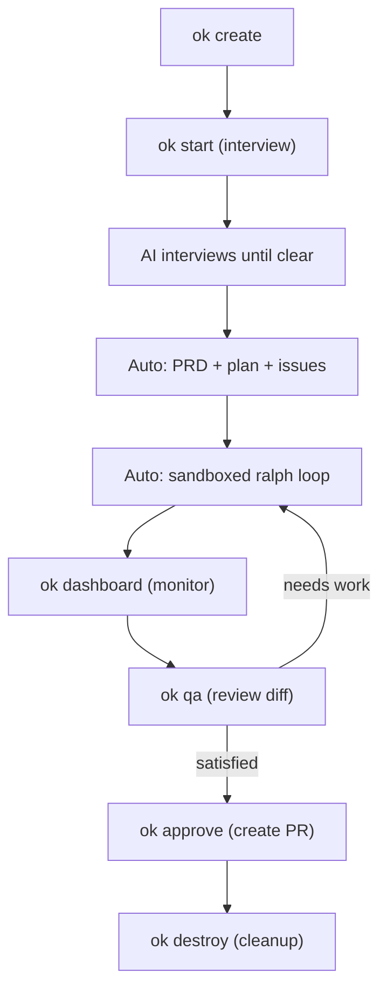

# AI Orchestration Kit

This kit is opinionated for one workflow only: PRD-first, interview-driven planning, then sandboxed autonomous execution.

## Quick start — Session workflow

The `ok` CLI wraps the entire flow into sessions. One command to go from idea to executing code:

```bash
ok create my-feature          # Create isolated session (branch + worktree)
ok start my-feature           # Interview → PRD → plan → issues → ralph loop
ok dashboard                  # Live pm2-style dashboard of all sessions
ok qa my-feature              # Stop execution, review diff
ok approve my-feature         # Create PR for merge
ok destroy my-feature         # Clean up
```



### Session lifecycle

| Command | What happens |
|---------|-------------|
| `ok create <name>` | Creates git branch `session/<name>`, worktree in `.ok/worktrees/<name>`, copies plan templates |
| `ok start <name> [N]` | Runs discovery interview via Claude, auto-generates PRD/plan/issues, starts ralph loop (N iterations, default 20) |
| `ok list` | Shows pm2-style table of all sessions with status, iterations, uptime |
| `ok dashboard` | Auto-refreshing live dashboard (press q to quit) |
| `ok logs <name> [-f]` | View or tail ralph execution logs |
| `ok stop <name>` | Stop the ralph loop |
| `ok qa <name>` | Stop execution, show diff summary vs base branch |
| `ok approve <name>` | Push branch, create PR for review/merge |
| `ok destroy <name>` | Remove worktree, branch, and session state |

### Parallel sessions

Each session is fully isolated via git worktrees — multiple sessions run simultaneously without interference:

```bash
ok create auth-login
ok start auth-login &
ok create api-cache
ok start api-cache &
ok dashboard                  # See both sessions running
```

## One-time setup

1. Install GitHub CLI and authenticate (`gh auth login`).
2. Install Claude Code CLI.
3. Install `jq`.
4. Install Docker Desktop and ensure it is running.

Quick check:

```bash
gh --version && claude --version && jq --version && docker --version
```

Install into a target repository:

```bash
bash orchestration-kit/scripts/install-into-target.sh /absolute/path/to/target-repo
```

Then in the target repo:

```bash
bash scripts/preflight-check.sh
bash scripts/sandbox-setup.sh
```

## Daily operating loop

### Using sessions (recommended)

```bash
ok create my-feature
ok start my-feature 15      # 15 ralph iterations max
# Answer interview questions, then execution starts automatically
ok dashboard                 # Monitor in another terminal
ok qa my-feature             # When complete, review
ok approve my-feature        # Create PR
```

### Manual flow (advanced)

If you prefer the step-by-step workflow:

1. Do discovery in Claude:

```text
/grill-me <your intent>
```

2. Generate and align on PRD:

```text
/write-a-prd
```

3. Generate implementation plan:

```text
/prd-to-plan
```

4. Generate implementation issues:

```text
/prd-to-issues
```

5. Execute in sandbox:

```bash
bash scripts/sandbox-loop.sh 10
```

6. Create QA issue after output is ready:

```bash
gh issue create \
  --title "QA: <feature name>" \
  --body "Verify behavior, test edge cases, and report gaps for PRD #<number>."
```

## Parallel PRDs (optional — manual flow)

The session workflow handles parallelism automatically via worktrees.
For the manual flow, the kit supports running multiple PRDs by isolating each into a track.

1. Create a track:

```bash
bash scripts/start-prd-track.sh <track-slug> <parent-prd-issue-number>
```

2. Keep each terminal pinned to one track and one PRD.
3. For issue execution, scope sandbox loop to that PRD:

```bash
RALPH_PARENT_PRD=<parent-prd-issue-number> bash scripts/sandbox-loop.sh 10
```

4. For plan-driven local loop, point context files at the track:

```bash
RALPH_CONTEXT_FILES='@plans/tracks/<track-slug>/prd.md @plans/tracks/<track-slug>/plan.md @plans/tracks/<track-slug>/progress.txt' bash scripts/ralph-loop.sh 10
```

This avoids cross-talk between concurrent initiatives and keeps each loop deterministic.

## Core scripts in this workflow

### Session CLI (`ok`)
- `ok` — main entry point (see `ok help`)
- `scripts/ok/` — session management scripts

### Manual scripts
1. `scripts/preflight-check.sh`
2. `scripts/sandbox-setup.sh`
3. `scripts/sandbox-once.sh`
4. `scripts/sandbox-loop.sh`
5. `scripts/sandbox-cleanup.sh`
6. `scripts/ralph-once.sh`
7. `scripts/ralph-loop.sh`
8. `scripts/start-prd-track.sh`

## Deep dive

See `ai-guide.md` for design rationale and operating guardrails.
